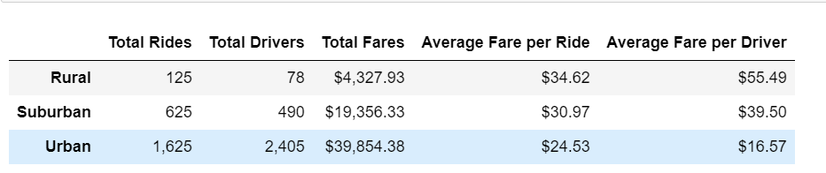
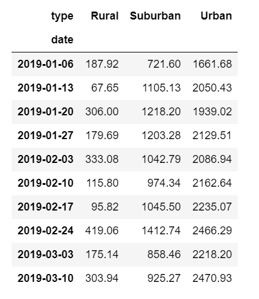
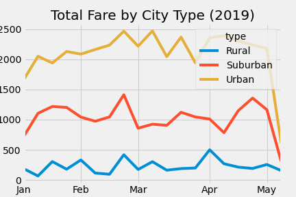

# PyBer_Analysis

## Overviews

The purpose of the new assignment is to create a summary DataFrame of the ride-sharing data by city type.
Upon the analysis and creaton of the new DataFrame, we are requred to use the new knowledge of Panda and Matplotlib to create a multiple-line graph that shows the total weekly fares for each city type.
    
## Results

The analysis brought up signfcnt disparity in the city ride sharing model. 

* Formatted DataFrame summary
   

As you can observe in the formatted DataFrame above, the urban city has the lowest fare per ride and driver. The fare is at $24.53 and $16.57 respectively. If we compare with Rural city, with fares per ride and driver respectively at $34.62 and $55.49; it is openely the highest of the three cities and three times more costly, on average fare per driver.

* Resampled DataFrame
   

Meanwhile, the results, in terms of weekly fares per city, vary consideraby by resampling our DataFrame. See the graph above. The main finding is that both urban and suburban cities are recording massive sales, o a weeekly basis compared to an nstable rural performnce. The main reason is on the number of rides per city and drivers willing to conduct their activities in those cities. The rural area is the least attracted and thus weekly fares are way too low. In terms of numbers, the last week of January 2019, the rural city recorded $179.69 total fares while Suburban and Urban posted $1,042,.79 and $2,086.94 respectively. That's ten to twenty folds compared to the Rural city.

* PyBer fare summary

To visualize the results and show the contrast, the graph above highlights the weekly peak and dip in the line graphs. Urban city hits an all time peak in the month of March and scattered line for the other two cities thereafter.

## Summary

Key recommendations upon the assessment are as follows:

1. Rural cities are not properly serviced. More drivers and buses to be allocated in the area in order to reduce the average fare;
2. Discontinue the rural cities business. With the data on hand, the total rides are weak, on a weekly basis, and drivers seem not like that area. The itinerary is clearly not profitable. The CEO can focus in maximzing the urban and suburban businesses.
3. Merge the rural city activities to the suburban by creatign an additional routes. The cost will reduce and fares will be constant since deserving nearly neighbourhood cities.